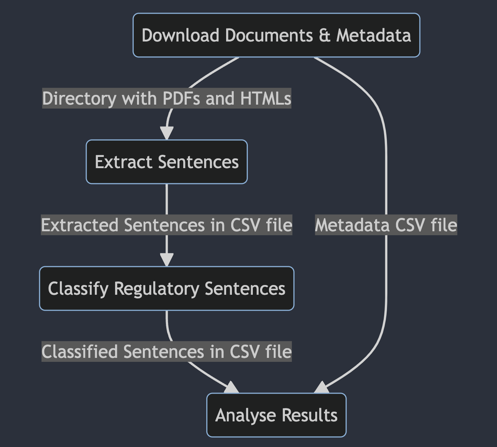
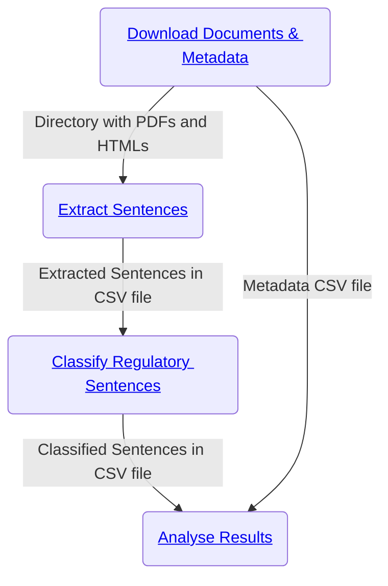

# eu-legislation-strictness-analysis
Scripts and files required for analysing strictness of EU legislation

### Pipeline diagram

```mermaid
flowchart TD
	A(<a href='https://github.com/nature-of-eu-rules/data-extraction'>Download Documents & Metadata</a>) -->| Directory with PDFs and HTMLs | B(<a 
href='https://github.com/nature-of-eu-rules/data-preprocessing'>Extract Sentences </a>)
	B -->| Extracted Sentences in CSV file | C(<a href='https://github.com/nature-of-eu-rules/regulatory-statement-classification'>Classify Regulatory Sentences</a>)
	C -->| Classified Sentences in CSV file | D(<a href='https://github.com/nature-of-eu-rules/eu-legislation-strictness-analysis'>Analyse Results</a>)
    A -->| Metadata CSV file | D
```
