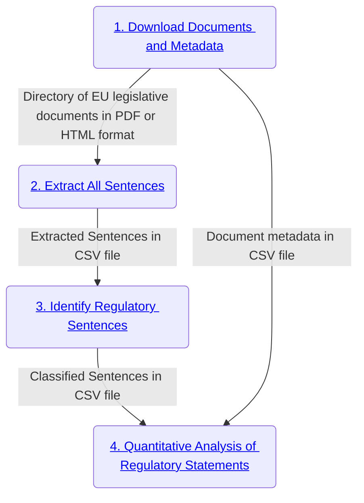

# eu-legislation-strictness-analysis
Scripts and files required for analysing strictness of EU legislation. The files in this repo have been created to perform ``strictness`` analysis of EU legislative documents. Prior to analysis by the scripts in this repository, the documents are downloaded and processed by a pipeline of software components, each associated with a different Github repository (see the diagram in the next section of this README for an illustration of the workflow). The processing results of the prior steps in the workflow are stored in two CSV files which serve as the input for the analysis scripts in this repository (the node labelled ``Quantitative Analysis of Regulatory Statements`` in the diagram in the next section represents the files of this repository).

### Pipeline diagram

This repository has scripts for performing analysis of EU legislative documents that have been processed in a specific manner. The files have been downloaded and processed by a pipeline of components, each component has its own repository because they are potentially useful as independent and reusable tools for other projects or purposes. In order to conduct the specific analysis described at the start of this README, we have extracted and processed the data as depicted in diagram (each node in the diagram is clickable and linked to a corresponding Github repository with more information about that specific component):



#### Requirements
+ [Python](https://www.python.org/downloads/) 3.9.12+
+ A tool for checking out a [Git](http://git-scm.com/) repository

#### Setup: before running any scripts in this repository

1. Get a copy of the code:

        git clone git@github.com:nature-of-eu-rules/eu-legislation-strictness-analysis.git
    
2. Change into the `eu-legislation-strictness-analysis/` directory:

        cd eu-legislation-strictness-analysis/
    
3. Create new [virtual environment](https://docs.python.org/3/library/venv.html) e.g:

        python -m venv path/to/virtual/environment/folder/
       
4. Activate new virtual environment e.g. for MacOSX users type: 

        source path/to/virtual/environment/folder/bin/activate
        
5. Install required libraries for the script in this virtual environment:

        pip install -r requirements.txt

### Usage: without [Docker](https://www.docker.com/)

1. Usage help for ```prepare-data-for-analysis.py```

        python prepare-data-for-analysis.py -h

2. Example usage for ```prepare-data-for-analysis.py```

        python prepare-data-for-analysis.py -m metadata.csv -c classified_sentences.csv -o metadata_with_classification_results.csv

3. Usage help for ```analysis.py```

        python analysis.py -h

4. Example usage for ```analysis.py```

         python analysis.py --input metadata_with_classification_results.csv --strictm count --output results/ -t date

###### Input

```prepare-data-for-analysis.py```

Two CSV files: 1) A CSV file generated by [this](https://github.com/nature-of-eu-rules/data-extraction/blob/main/eu_rules_metadata_extractor.py) script containing metadata (such as adoption dates and legal policy areas addressed etc.) about EU legislative documents downloaded from [EURLEX](https://eur-lex.europa.eu/), and 2) A CSV file generated with the help of either [this](https://github.com/nature-of-eu-rules/regulatory-statement-classification/blob/main/classify_text_with_inlegal_bert_xgboost.py) or [this](https://github.com/nature-of-eu-rules/regulatory-statement-classification/blob/main/rule-based-classification.py) script (different approaches to classifying regulatory sentences) containing a list of sentences with a list of celex numbers of the documents in which they originate, and a column which shows whether a sentence was classified as regulatory (indicated by a `1`) or constitutive (indicated with `0`). See the [data-extraction](https://github.com/nature-of-eu-rules/data-extraction) and [regulatory-statement-classification](https://github.com/nature-of-eu-rules/regulatory-statement-classification) repositories for more detailed information about the input data.

```analysis.py```

The output of CSV file generated by ```prepare-data-for-analysis.py``` is the main input file. There are some required and optional switches (arguments) for this script:

+ ```--strictm``` : this is the particular strictness metric we want to use for the analysis. Currently this can be one of two values ```count``` (the count of regulatory statements) and ```mean``` (the average number of regulatory statements per document). But these metrics are just the starting point for exploring strictness and there would be more metrics defined in future.
+ ```--nozeros``` : this boolean flag indicates whether we want to analyse only those documents which contain at least one regulatory statement or do we wish to analyse all documents (by default we analyse all)
+ ```--time``` : this refers to the temporal unit that we wish to use when analysing the change of strictness over time. This can currently be one of two values ```year``` (analyses overall strictness in a particular year) or ```date``` (analyses the strictness of legislation on a particular day or date e.g. 2022-01-01). 

###### Output

```prepare-data-for-analysis.py```

A CSV file which looks very similar to the input metadata file mentioned in the previous section but with new columns for the number of regulatory sentences identified in each document, number of sentences and words in that document etc.

```analysis.py```

A directory with generated interactive ```.html``` plots and plot image files (```.svg```) describing to some extent the strictness or density of regulatory statements in the input documents (over time and by [legal policy area](https://eur-lex.europa.eu/browse/directories/legislation.html)).

### Usage: with [Docker](https://www.docker.com/)

Coming soon...