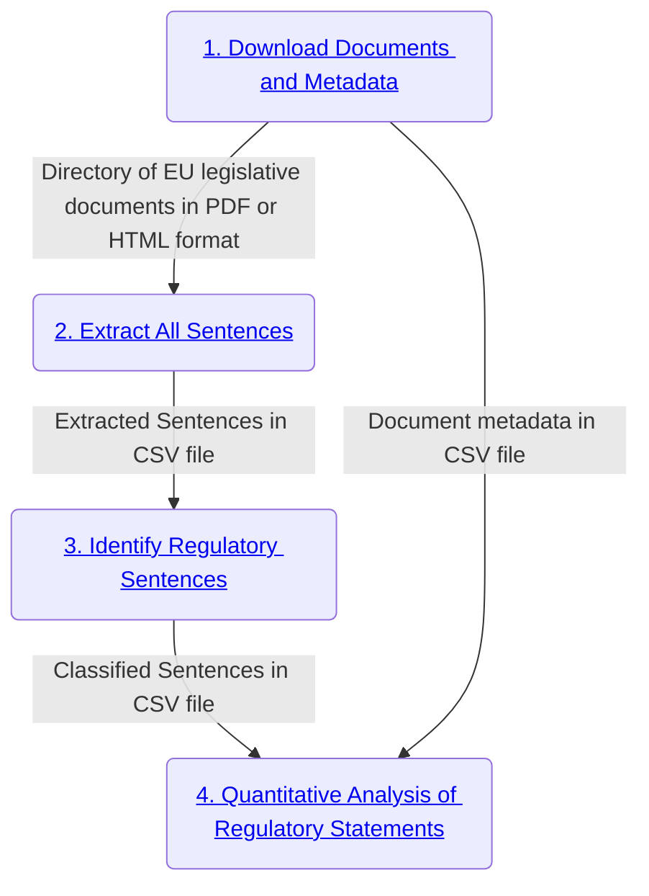

# eu-legislation-strictness-analysis
Scripts and files required for analysing strictness of EU legislation. The files in this repo have been created to perform ``strictness`` analysis of approximately 120,000 EU legislative documents spanning the time frame 1971-2022. Prior to analysis by the scripts in this repository, the documents have been downloaded and processed by a pipeline of software components, each associated with a different Github repository (see the diagram in the next section of this README for an illustration of the workflow). The processing results of the prior steps in the workflow are stored in two CSV files which serve as the input for the analysis scripts in this repository (the node labelled ``Quantitative Analysis of Regulatory Statements`` in the diagram in the next section represents the files of this repository).

### Pipeline diagram

This repository has scripts for performing analysis of EU legislative documents that have been processed in a specific manner. The files have been downloaded and processed by a pipeline of components, each component has its own repository because they are potentially useful as independent and reusable tools for other projects or purposes. In order to conduct the specific analysis described at the start of this README, we have extracted and processed the data as depicted in diagram (each node in the diagram is clickable and linked to a corresponding Github repository with more information about that specific component):

